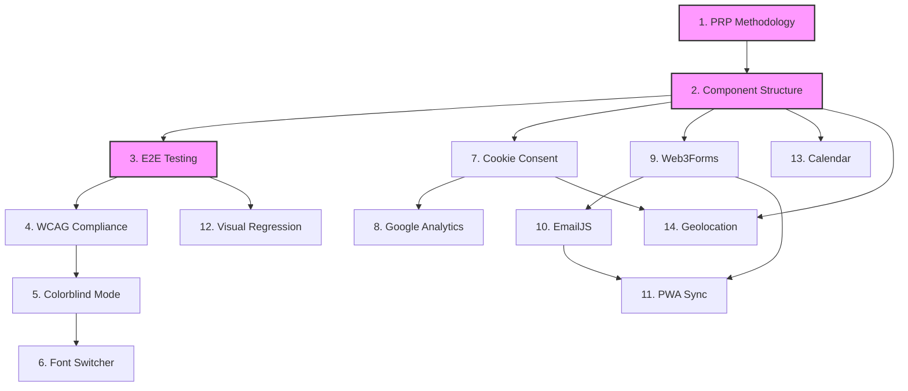

# PRP Implementation Status Dashboard

**Last Updated**: 2025-09-13
**Total PRPs**: 14
**Completed**: 0
**In Progress**: 0
**Pending**: 14

---

## Quick Status Overview

```
Phase 1: Foundation     [⬜⬜⬜] 0/3 Complete
Phase 2: Compliance     [⬜⬜⬜] 0/3 Complete
Phase 3: Privacy        [⬜⬜]   0/2 Complete
Phase 4: Forms          [⬜⬜⬜] 0/3 Complete
Phase 5: Features       [⬜⬜⬜] 0/3 Complete
```

## Detailed Implementation Status

### Phase 1: Foundation Infrastructure

| #   | PRP                   | Priority | Status   | Branch                    | Started | Completed | Notes                          |
| --- | --------------------- | -------- | -------- | ------------------------- | ------- | --------- | ------------------------------ |
| 1   | PRP Methodology       | P0       | 📥 Inbox | `001-prp-methodology`     | -       | -         | Establishes PRP workflow       |
| 2   | Component Structure   | P0       | 📥 Inbox | `002-component-structure` | -       | -         | 4-file pattern standardization |
| 3   | E2E Testing Framework | P0       | 📥 Inbox | `003-e2e-testing`         | -       | -         | Playwright setup               |

### Phase 2: Compliance & Accessibility

| #   | PRP                | Priority | Status   | Branch                | Started | Completed | Notes                       |
| --- | ------------------ | -------- | -------- | --------------------- | ------- | --------- | --------------------------- |
| 4   | WCAG AA Compliance | P0       | 📥 Inbox | `004-wcag-compliance` | -       | -         | Pa11y, axe-core integration |
| 5   | Colorblind Mode    | P0       | 📥 Inbox | `005-colorblind-mode` | -       | -         | Accessibility filters       |
| 6   | Font Switcher      | P1       | 📥 Inbox | `006-font-switcher`   | -       | -         | Typography customization    |

### Phase 3: Privacy & Analytics

| #   | PRP                   | Priority | Status   | Branch                 | Started | Completed | Notes              |
| --- | --------------------- | -------- | -------- | ---------------------- | ------- | --------- | ------------------ |
| 7   | Cookie Consent & GDPR | P0       | 📥 Inbox | `007-cookie-consent`   | -       | -         | Privacy compliance |
| 8   | Google Analytics      | P1       | 📥 Inbox | `008-google-analytics` | -       | -         | GA4 with consent   |

### Phase 4: Forms & Communication

| #   | PRP                   | Priority | Status   | Branch               | Started | Completed | Notes                   |
| --- | --------------------- | -------- | -------- | -------------------- | ------- | --------- | ----------------------- |
| 9   | Web3Forms Integration | P0       | 📥 Inbox | `009-web3forms`      | -       | -         | Primary contact form    |
| 10  | EmailJS Integration   | P1       | 📥 Inbox | `010-emailjs-backup` | -       | -         | Fallback email service  |
| 11  | PWA Background Sync   | P0       | 📥 Inbox | `011-pwa-sync`       | -       | -         | Offline form submission |

### Phase 5: Additional Features

| #   | PRP                       | Priority | Status   | Branch                  | Started | Completed | Notes            |
| --- | ------------------------- | -------- | -------- | ----------------------- | ------- | --------- | ---------------- |
| 12  | Visual Regression Testing | P0       | 📥 Inbox | `012-visual-regression` | -       | -         | Chromatic/Percy  |
| 13  | Calendar Integration      | P2       | 📥 Inbox | `013-calendar`          | -       | -         | Calendly/Cal.com |
| 14  | Geolocation Map           | P2       | 📥 Inbox | `014-geolocation`       | -       | -         | Leaflet maps     |

## Status Legend

- 📥 **Inbox**: Not started, awaiting dependencies
- 🚀 **Ready**: Dependencies met, can begin
- 🔄 **In Progress**: Active development
- 🔍 **In Review**: PR submitted, awaiting review
- ✅ **Completed**: Merged to main
- ⏸️ **Blocked**: Issue encountered, see notes
- 🔙 **Rolled Back**: Reverted due to issues

## Dependency Graph



## Implementation Metrics

### Velocity

- **Average PRP Completion Time**: TBD
- **Current Sprint**: Phase 1 Foundation
- **Estimated Completion**: TBD

### Quality Metrics

- **Tests Written**: 0
- **Test Coverage**: 0%
- **Accessibility Score**: TBD
- **Lighthouse Score**: TBD

## Lessons Learned

### Successful Patterns

- (To be documented as PRPs are completed)

### Challenges & Solutions

- (To be documented as issues arise)

### Process Improvements

- (To be documented based on experience)

## Next Actions

### Immediate (Current PRP)

1. Create branch `001-prp-methodology`
2. Copy PRP to specs directory
3. Run `/plan` command
4. Generate tasks with `/tasks`
5. Begin implementation

### Upcoming (Next 3 PRPs)

- Prepare Component Structure PRP
- Review E2E Testing requirements
- Gather WCAG compliance tools

### Blocked Items

- None currently

## Resource Links

- [PRP Workflow Documentation](./PRP-WORKFLOW.md)
- [Constitution](./.specify/memory/constitution.md)
- [Original SPEC](./SPEC.md)
- [PRP Template](../spec-kit/prp/templates/prp-template.md)

## Notes

### Risk Factors

- **High Risk**: None identified
- **Medium Risk**: GA4 integration depends on cookie consent
- **Low Risk**: Calendar and geolocation are independent

### Dependencies on External Services

- Web3Forms: Requires API key
- EmailJS: Requires account setup
- Google Analytics: Requires GA4 property
- Calendly/Cal.com: Requires account
- Chromatic/Percy: Requires account for visual regression

### Technical Debt Tracking

- (To be documented as implementation proceeds)

---

**Dashboard Usage**: Update this dashboard after each PRP milestone:

1. Branch creation
2. Implementation start
3. PR submission
4. Merge to main
5. Any blocking issues
