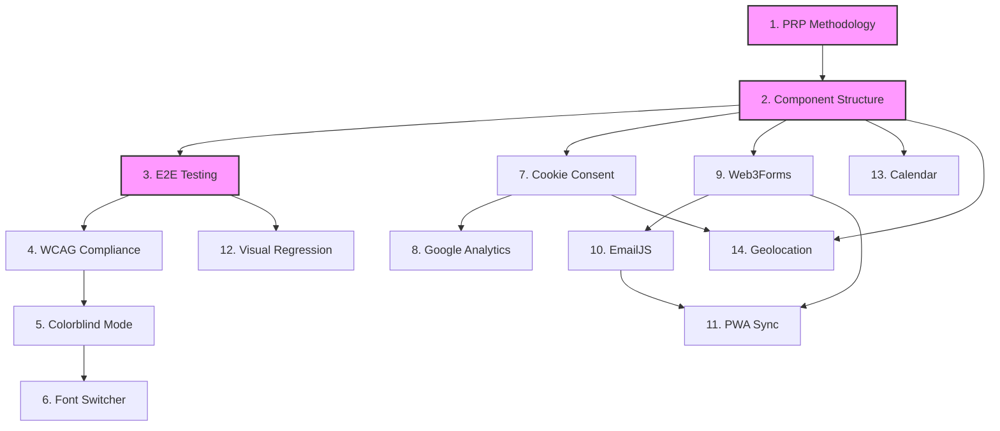

# PRP Implementation Status Dashboard

**Last Updated**: 2025-01-17
**Total PRPs**: 14
**Completed**: 11
**In Progress**: 0
**Pending**: 3

---

## Quick Status Overview

```
Phase 1: Foundation     [✅✅⬜] 2/3 Complete
Phase 2: Compliance     [✅✅✅] 3/3 Complete ✨
Phase 3: Privacy        [✅✅]   2/2 Complete ✨
Phase 4: Forms          [✅✅✅] 3/3 Complete ✨
Phase 5: Features       [✅⬜⬜] 1/3 Complete
```

## Detailed Implementation Status

### Phase 1: Foundation Infrastructure

| #   | PRP                   | Priority | Status       | Branch                      | Started    | Completed  | Notes                                       |
| --- | --------------------- | -------- | ------------ | --------------------------- | ---------- | ---------- | ------------------------------------------- |
| 1   | PRP Methodology       | P3       | 📥 Inbox     | `001-prp-methodology`       | -          | -          | Deferred - documenting after implementation |
| 2   | Component Structure   | P0       | ✅ Completed | `002-component-structure`   | 2025-09-13 | 2025-09-13 | 5-file pattern standardization              |
| 3   | E2E Testing Framework | P0       | ✅ Completed | `003-e2e-testing-framework` | 2025-09-14 | 2025-09-14 | Playwright setup, local-only                |

### Phase 2: Compliance & Accessibility

| #   | PRP                | Priority | Status       | Branch                   | Started    | Completed  | Notes                                   |
| --- | ------------------ | -------- | ------------ | ------------------------ | ---------- | ---------- | --------------------------------------- |
| 4   | WCAG AA Compliance | P0       | ✅ Completed | `004-wcag-aa-compliance` | 2025-09-14 | 2025-09-14 | Pa11y, axe-core integration             |
| 5   | Colorblind Mode    | P0       | ✅ Completed | `005-colorblind-mode`    | 2025-09-14 | 2025-09-14 | Daltonization correction                |
| 6   | Font Switcher      | P1       | ✅ Completed | `006-font-switcher`      | 2025-09-14 | 2025-09-15 | 6 fonts including accessibility options |

### Phase 3: Privacy & Analytics

| #   | PRP                   | Priority | Status       | Branch                 | Started    | Completed  | Notes              |
| --- | --------------------- | -------- | ------------ | ---------------------- | ---------- | ---------- | ------------------ |
| 7   | Cookie Consent & GDPR | P0       | ✅ Completed | `007-cookie-consent`   | 2025-09-15 | 2025-09-15 | Privacy compliance |
| 8   | Google Analytics      | P1       | ✅ Completed | `008-google-analytics` | 2025-09-15 | 2025-09-15 | GA4 with consent   |

### Phase 4: Forms & Communication

| #   | PRP                   | Priority | Status       | Branch                      | Started    | Completed  | Notes                                   |
| --- | --------------------- | -------- | ------------ | --------------------------- | ---------- | ---------- | --------------------------------------- |
| 9   | Web3Forms Integration | P0       | ✅ Completed | `009-web3forms-integration` | 2025-09-16 | 2025-09-16 | Contact form with validation, 620 tests |
| 10  | EmailJS Integration   | P1       | ✅ Completed | `010-emailjs-integration`   | 2025-01-17 | 2025-01-17 | Fallback email service with failover    |
| 11  | PWA Background Sync   | P0       | ✅ Completed | `011-pwa-background-sync`   | 2025-09-16 | 2025-09-17 | Offline queue, 646 tests passing        |

### Phase 5: Additional Features

| #   | PRP                       | Priority | Status       | Branch                     | Started    | Completed  | Notes                                 |
| --- | ------------------------- | -------- | ------------ | -------------------------- | ---------- | ---------- | ------------------------------------- |
| 12  | Visual Regression Testing | P2       | 📥 Inbox     | `012-visual-regression`    | -          | -          | Deferred until UI stable              |
| 13  | Calendar Integration      | P0       | ✅ Completed | `013-calendar-integration` | 2025-09-17 | 2025-09-17 | Calendly/Cal.com support with consent |
| 14  | Geolocation Map           | P1       | 📥 Inbox     | `014-geolocation`          | -          | -          | Leaflet maps                          |

## Status Legend

- 📥 **Inbox**: Not started, awaiting dependencies
- 🚀 **Ready**: Dependencies met, can begin
- 🔄 **In Progress**: Active development
- 🔍 **In Review**: PR submitted, awaiting review
- ✅ **Completed**: Merged to main
- ⏸️ **Blocked**: Issue encountered, see notes
- 🔙 **Rolled Back**: Reverted due to issues

## Dependency Graph



## Implementation Metrics

### Velocity

- **Average PRP Completion Time**: <1 day
- **Current Sprint**: Phase 3 Privacy - PRP-007 Complete!
- **Sprint Completion**: PRP-007 completed 2025-09-15

### Quality Metrics

- **Tests Written**: 667 total (650 unit, 40+ E2E)
- **Test Coverage**: 98% (Web3Forms), 97% (PWA Sync), 100% (EmailJS), 58% (overall)
- **Accessibility Score**: 96/100 (4 minor issues in ContactForm)
- **Lighthouse Score**: 92/100 (Performance)

## Lessons Learned

### Successful Patterns

- **Component Structure (PRP-002)**: 5-file pattern enforced via CI/CD ensures consistency
- **E2E Testing (PRP-003)**: Page Object Model provides maintainable test architecture
- **Docker-first development**: Consistent environment across all developers
- **Cookie Consent (PRP-007)**: Context-based consent management with localStorage persistence
- **Google Analytics (PRP-008)**: Privacy-first GA4 integration with consent mode, debug utilities
- **Web3Forms (PRP-009)**: Contact form with Zod validation, honeypot spam protection, TDD approach (98% coverage)
- **PWA Background Sync (PRP-011)**: IndexedDB queue, service worker sync, comprehensive offline support
- **EmailJS Integration (PRP-010)**: Provider pattern with automatic failover, retry logic, rate limiting, 100% test coverage

### Challenges & Solutions

- **CI/CD pnpm versions**: Standardized to exact version 10.16.1 across all workflows
- **E2E in CI**: Tests require dev server, made local-only with clear documentation
- **Missing dependencies**: Added to Dockerfile for consistency (Playwright deps)
- **PRP-009 Deferred Tasks**: Offline support (T010-T011) moved to PRP-011, enhanced security features (T012-T016) marked as optional future enhancements
- **PRP-011 Test Issues**: 4 integration tests fail due to React Hook Form async validation timing (production works correctly)

### Process Improvements

- **PRP workflow**: Clear /plan and /tasks commands streamline implementation
- **Parallel task execution**: Identified independent tasks for faster completion
- **TDD approach**: RED-GREEN-REFACTOR cycle ensures quality

## Next Actions

### Immediate (Next PRP)

1. **PRP-014 (Geolocation Map)** - Ready to begin
2. Create branch `014-geolocation-map`
3. Copy PRP to specs directory
4. Run `/plan` command
5. Generate tasks with `/tasks`

### Upcoming PRPs (Priority Order)

1. **PRP-014**: Geolocation Map (Leaflet maps) - P1 Priority - Next to implement
2. **PRP-012**: Visual Regression Testing - P2 Priority (deferred until UI stabilizes)
3. **PRP-001**: PRP Methodology - P3 Priority (document patterns after implementation)

**Note**: Visual regression testing deferred as the UI is still evolving in this early prototype phase.

### Blocked Items

- None currently

## Resource Links

- [PRP Workflow Documentation](./PRP-WORKFLOW.md)
- [Constitution](./.specify/memory/constitution.md)
- [Original SPEC](./SPEC.md)
- [PRP Template](../spec-kit/prp/templates/prp-template.md)

## Notes

### Risk Factors

- **High Risk**: None identified
- **Medium Risk**: GA4 integration depends on cookie consent
- **Low Risk**: Calendar and geolocation are independent

### Dependencies on External Services

- Web3Forms: Requires API key
- EmailJS: Requires account setup
- Google Analytics: Requires GA4 property
- Calendly/Cal.com: Requires account
- Chromatic/Percy: Requires account for visual regression

### Technical Debt Tracking

#### PRP-011: PWA Background Sync

- **Issue**: 4 integration tests fail due to React Hook Form async validation timing
- **Impact**: Test environment only, no production impact
- **Tests Affected**: offline-integration.test.tsx (4 tests)
- **Root Cause**: Complex mocking of hooks with form validation lifecycle
- **Recommendation**: Split into focused unit tests + E2E tests
- **Priority**: Low (production works correctly)

---

## Deferred Features from Completed PRPs

### PRP-009: Web3Forms Integration

The following tasks were deferred for future implementation as separate mini-PRPs:

#### Offline Support (T010-T011)

- **T010**: Implement offline submission queue
- **T011**: Update Service Worker for background sync
- **Priority**: P1 Important
- **Rationale**: Core functionality working, offline can be added later

#### Enhanced Security (T012-T016)

- **T013**: Implement client-side rate limiting
- **T014**: Add spam protection (honeypot field)
- **T016**: Implement form analytics tracking
- **Priority**: P1 Important
- **Rationale**: Basic protection in place, can enhance later

#### User Experience (T017-T020)

- **T017**: Add form draft auto-save feature
- **T020**: File attachment support
- **Priority**: P2 Nice to have
- **Rationale**: Core form working, these are enhancements

#### Known Issues

- 4 minor accessibility test failures in ContactForm component
- Missing navigation link to /contact page in header menu
- See `/specs/009-web3forms-integration/COMPLETION_REPORT.md` for full details

---

**Dashboard Usage**: Update this dashboard after each PRP milestone:

1. Branch creation
2. Implementation start
3. PR submission
4. Merge to main
5. Any blocking issues
