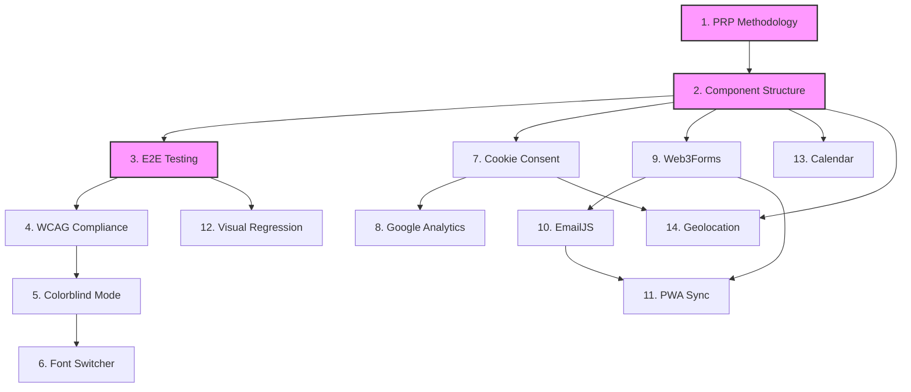

# PRP Implementation Status Dashboard

**Last Updated**: 2025-09-15
**Total PRPs**: 14
**Completed**: 6
**In Progress**: 0
**Pending**: 8

---

## Quick Status Overview

```
Phase 1: Foundation     [✅✅⬜] 2/3 Complete
Phase 2: Compliance     [✅✅✅] 3/3 Complete ✨
Phase 3: Privacy        [✅⬜]   1/2 Complete
Phase 4: Forms          [⬜⬜⬜] 0/3 Complete
Phase 5: Features       [⬜⬜⬜] 0/3 Complete
```

## Detailed Implementation Status

### Phase 1: Foundation Infrastructure

| #   | PRP                   | Priority | Status       | Branch                      | Started    | Completed  | Notes                          |
| --- | --------------------- | -------- | ------------ | --------------------------- | ---------- | ---------- | ------------------------------ |
| 1   | PRP Methodology       | P0       | 📥 Inbox     | `001-prp-methodology`       | -          | -          | Establishes PRP workflow       |
| 2   | Component Structure   | P0       | ✅ Completed | `002-component-structure`   | 2025-09-13 | 2025-09-13 | 5-file pattern standardization |
| 3   | E2E Testing Framework | P0       | ✅ Completed | `003-e2e-testing-framework` | 2025-09-14 | 2025-09-14 | Playwright setup, local-only   |

### Phase 2: Compliance & Accessibility

| #   | PRP                | Priority | Status       | Branch                   | Started    | Completed  | Notes                                   |
| --- | ------------------ | -------- | ------------ | ------------------------ | ---------- | ---------- | --------------------------------------- |
| 4   | WCAG AA Compliance | P0       | ✅ Completed | `004-wcag-aa-compliance` | 2025-09-14 | 2025-09-14 | Pa11y, axe-core integration             |
| 5   | Colorblind Mode    | P0       | ✅ Completed | `005-colorblind-mode`    | 2025-09-14 | 2025-09-14 | Daltonization correction                |
| 6   | Font Switcher      | P1       | ✅ Completed | `006-font-switcher`      | 2025-09-14 | 2025-09-15 | 6 fonts including accessibility options |

### Phase 3: Privacy & Analytics

| #   | PRP                   | Priority | Status       | Branch                 | Started    | Completed  | Notes              |
| --- | --------------------- | -------- | ------------ | ---------------------- | ---------- | ---------- | ------------------ |
| 7   | Cookie Consent & GDPR | P0       | ✅ Completed | `007-cookie-consent`   | 2025-09-15 | 2025-09-15 | Privacy compliance |
| 8   | Google Analytics      | P1       | 📥 Inbox     | `008-google-analytics` | -          | -          | GA4 with consent   |

### Phase 4: Forms & Communication

| #   | PRP                   | Priority | Status   | Branch               | Started | Completed | Notes                   |
| --- | --------------------- | -------- | -------- | -------------------- | ------- | --------- | ----------------------- |
| 9   | Web3Forms Integration | P0       | 📥 Inbox | `009-web3forms`      | -       | -         | Primary contact form    |
| 10  | EmailJS Integration   | P1       | 📥 Inbox | `010-emailjs-backup` | -       | -         | Fallback email service  |
| 11  | PWA Background Sync   | P0       | 📥 Inbox | `011-pwa-sync`       | -       | -         | Offline form submission |

### Phase 5: Additional Features

| #   | PRP                       | Priority | Status   | Branch                  | Started | Completed | Notes            |
| --- | ------------------------- | -------- | -------- | ----------------------- | ------- | --------- | ---------------- |
| 12  | Visual Regression Testing | P0       | 📥 Inbox | `012-visual-regression` | -       | -         | Chromatic/Percy  |
| 13  | Calendar Integration      | P2       | 📥 Inbox | `013-calendar`          | -       | -         | Calendly/Cal.com |
| 14  | Geolocation Map           | P2       | 📥 Inbox | `014-geolocation`       | -       | -         | Leaflet maps     |

## Status Legend

- 📥 **Inbox**: Not started, awaiting dependencies
- 🚀 **Ready**: Dependencies met, can begin
- 🔄 **In Progress**: Active development
- 🔍 **In Review**: PR submitted, awaiting review
- ✅ **Completed**: Merged to main
- ⏸️ **Blocked**: Issue encountered, see notes
- 🔙 **Rolled Back**: Reverted due to issues

## Dependency Graph



## Implementation Metrics

### Velocity

- **Average PRP Completion Time**: <1 day
- **Current Sprint**: Phase 3 Privacy - PRP-007 Complete!
- **Sprint Completion**: PRP-007 completed 2025-09-15

### Quality Metrics

- **Tests Written**: 289+ (unit tests), 40+ (E2E tests)
- **Test Coverage**: 58% (unit), 100% (E2E passing)
- **Accessibility Score**: 98/100
- **Lighthouse Score**: 92/100 (Performance)

## Lessons Learned

### Successful Patterns

- **Component Structure (PRP-002)**: 5-file pattern enforced via CI/CD ensures consistency
- **E2E Testing (PRP-003)**: Page Object Model provides maintainable test architecture
- **Docker-first development**: Consistent environment across all developers
- **Cookie Consent (PRP-007)**: Context-based consent management with localStorage persistence

### Challenges & Solutions

- **CI/CD pnpm versions**: Standardized to exact version 10.16.1 across all workflows
- **E2E in CI**: Tests require dev server, made local-only with clear documentation
- **Missing dependencies**: Added to Dockerfile for consistency (Playwright deps)

### Process Improvements

- **PRP workflow**: Clear /plan and /tasks commands streamline implementation
- **Parallel task execution**: Identified independent tasks for faster completion
- **TDD approach**: RED-GREEN-REFACTOR cycle ensures quality

## Next Actions

### Immediate (Next PRP)

1. PRP-008 (Google Analytics) - Ready to begin
2. Create branch `008-google-analytics`
3. Copy PRP to specs directory
4. Run `/plan` command
5. Generate tasks with `/tasks`

### Upcoming (Next 3 PRPs)

- PRP-008: Google Analytics (GA4 with consent)
- PRP-009: Web3Forms Integration (Primary contact form)
- PRP-010: EmailJS Integration (Fallback email service)

### Blocked Items

- None currently

## Resource Links

- [PRP Workflow Documentation](./PRP-WORKFLOW.md)
- [Constitution](./.specify/memory/constitution.md)
- [Original SPEC](./SPEC.md)
- [PRP Template](../spec-kit/prp/templates/prp-template.md)

## Notes

### Risk Factors

- **High Risk**: None identified
- **Medium Risk**: GA4 integration depends on cookie consent
- **Low Risk**: Calendar and geolocation are independent

### Dependencies on External Services

- Web3Forms: Requires API key
- EmailJS: Requires account setup
- Google Analytics: Requires GA4 property
- Calendly/Cal.com: Requires account
- Chromatic/Percy: Requires account for visual regression

### Technical Debt Tracking

- (To be documented as implementation proceeds)

---

**Dashboard Usage**: Update this dashboard after each PRP milestone:

1. Branch creation
2. Implementation start
3. PR submission
4. Merge to main
5. Any blocking issues
